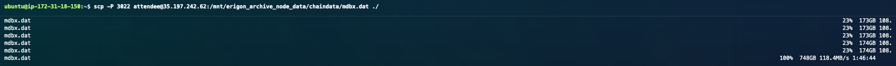
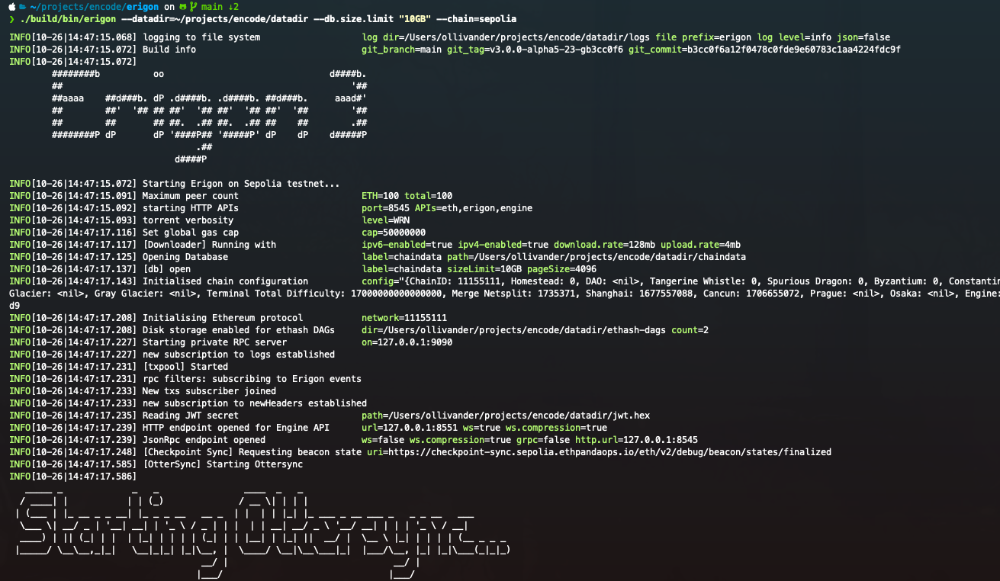

# CompassClip

Runs SuperSet JSON-RPC calls to a chain, storing the result in S3.

Provides a wrapper library for making RPC calls to these files to collect desired information

## Installation
Run python3.11 or lower. It is recommended this project is run in venv.

```
python3 -m pip install -r requirements.txt
```

## aims

- How many chains supported? - any that have an rpc client
- Include with n degree proximity to origin contract
  - can collect addresses and then re-run a separate exporter to append these to the file stores
- Include all transactions - remove address filtering
- RPC methods can it respond to - lib implementation for each as below. Focused on key look up
  patterns

## eth_ method focuses

- `eth_getCode`
- `eth_getStorageAt`
- `eth_getTransaction`

https://docs.alchemy.com/reference/eth-gettransactionbyhash

## Feature Improvements

* As discussed below, use an Erigon node directly to hit the database directly and ignore the
  overhead of rpc calls.
* facility for real time syncing to the chian, indexing storage say by block range

## Alternative approach: Patching an Existing Chain

### Erigon

Experimented with usage of mbdx.dat file that erigon uses.

https://ethereum.org/en/developers/docs/nodes-and-clients/archive-nodes/#what-is-an-archive-node
https://lmdb.readthedocs.io/en/release/ - lmdb, python client used to investigate database structure
on file



as specified at *https://github.com/erigontech/erigon/blob/main/ethdb/Readme.md*
mdbx file format is a key-value database, utilising B+ trees in order to store reciept, transaction
and block data in a mapping format.

```asciiflow.com
// This is not call graph, just show classes from low-level to high-level.
// And show which classes satisfy which interfaces.

                    +-----------------------------------+   +-----------------------------------+
                    |  github.com/erigontech/mdbx-go    |   | google.golang.org/grpc.ClientConn |
                    |  (app-agnostic MDBX go bindings)  |   | (app-agnostic RPC and streaming)  |
                    +-----------------------------------+   +-----------------------------------+
                                      |                                      |
                                      |                                      |
                                      v                                      v
                    +-----------------------------------+   +-----------------------------------+
                    |       ethdb/kv_mdbx.go            |   |       ethdb/kv_remote.go          |
                    |  (tg-specific MDBX implementation) |   |   (tg-specific remote DB access)  |
                    +-----------------------------------+   +-----------------------------------+
                                      |                                      |
                                      |                                      |
                                      v                                      v
            +----------------------------------------------------------------------------------------------+
            |                                       ethdb/kv_abstract.go                                   |
            |         (Common KV interface. DB-friendly, disk-friendly, cpu-cache-friendly.                |
            |           Same app code can work with local or remote database.                              |
            |           Allows experiment with another database implementations.                           |
            |          Supports context.Context for cancellation. Any operation can return error)           |
            +----------------------------------------------------------------------------------------------+
                 |                                        |                                      |
                 |                                        |                                      |
                 v                                        v                                      v
+-----------------------------------+   +-----------------------------------+   +-----------------------------------+
|       ethdb/object_db.go          |   |          ethdb/tx_db.go           |   |    ethdb/remote/remotedbserver    |
|     (thread-safe, stateless,      |   | (non-thread-safe, more performant |   | (grpc server, using kv_abstract,  |
|   opens/close short transactions  |   |   than object_db, method Begin    |   |   kv_remote call this server, 1   |
|      internally when need)        |   |  DOESN'T create new TxDb object)  |   | transaction maps on 1 grpc stream |
+-----------------------------------+   +-----------------------------------+   +-----------------------------------+
                |                                          |
                |                                          |
                v                                          v
            +-----------------------------------------------------------------------------------------------+
            |                                    ethdb/interface.go                                         |
            |     (Common DB interfaces. ethdb.Database and ethdb.DbWithPendingMutations are widely used)   |
            +-----------------------------------------------------------------------------------------------+
                |
                |
                v
+--------------------------------------------------+
|             ethdb/mutation.go                    |
| (also known as "batch", recording all writes and |
|   them flush to DB in sorted way only when call  |
|     .Commit(), use it to avoid random-writes.    |
|   It use and satisfy ethdb.Database in same time |
+--------------------------------------------------+

```

Further details can be found at
https://github.com/erigontech/erigon/blob/main/docs/programmers_guide/db_walkthrough.MD. While this
is an interesting read, it reveals about as much as the Dragon scroll did in the first Kung Fu Panda
film.

The key part here is the ethdb/kv-abstract.go implementation. An ideal solution would interface
directly with the database using one of the methods described in
https://github.com/erigontech/erigon/blob/main/docs/programmers_guide/db_faq.md. This by passes the
rpc interface, thus as long as the file can be read either locally or via ssh-fs seek calls, one
could utilise the `RoKV` interface that is provided to quickly make abstracted `eth_` calls to get
the information required.

Using this interface, a duplicate mdbx.dat could be created. One would read from one file to collect
whats needed to write to another one. Writing however is the tricky part. The provided methods
assume a "node" is running and thus expect all the checksums to be correct. If one was to prune
transactions to only collect ones that touched specific contract addresses, this would break the
ability to "run on the chain".




The advantage of an mdbx.dat storage format is that an Erigon archive node would be able to read
from it, thus enabling use of their existing `rpcdaemon` lib and native calls to a pruned private
blockchain only containing relevant contract address information.

To conclude, an approach of patching a node would require:

* creating methods for writing to a new mdbx.dat file in the same format Erigon expects
    * add new methods for back populating block data, deleting transactions for instance that do not
    meet certain requirements
    * use existing methods of writing a new block by mining it on to a private chain, only including
      the filtered addresses. This however would invalidate checksums. This would either need to be
      ignored when the pruned node is queried or overwritten in some way and any errors thrown
      because of it discarded
* hotfix the sync library to enable an option to migrate one mdbx.dat file to another
* hope and pray the pruned mdbx.dat file is compatible

The above libs would have to be maintained with each Erigon node release for each support langugage
(Rust, C++ and go)

### Anvil


### Geth

Running a private pruned blockchain as a geth node.
t

* Fork an existing chain for study. Back delete unneeded transactions. This would however not allow
  clean resyncing
* Sync on a polling basis to a new chain, mining each block on with only necessary transactions.
  This would not be a valid blockchain and would need be a new protocol specific for each chain and
  therefore a heavy approach.


### TheGraph

https://thegraph.com
